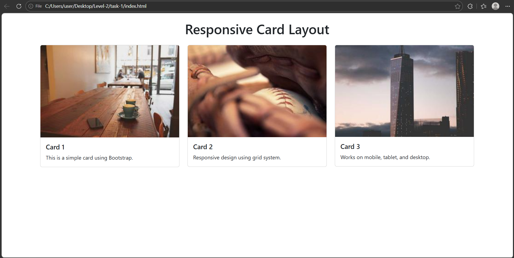

# 📱 Cognifyz Web Development Internship - Level 2 Task 1

## 📌 Project Overview

This project is part of the **Cognifyz Web Development Internship Program**.
In this task, I used a **frontend framework (Bootstrap)** to design a responsive layout with card components.

---

## 🎯 Task Objective

The objective of this task is to:

* Use a frontend framework like Bootstrap
* Create a **responsive card component** (image + text)
* Implement a **responsive grid layout**

---

## 🛠️ Technologies Used

* HTML5
* Bootstrap 5 (Frontend Framework)

---

## ✨ Features

✔ Responsive card components with images and text
✔ Grid layout using Bootstrap system
✔ Mobile-friendly design
✔ Clean and modern UI

---

## 📸 Output Preview



---

## 🚀 How to Run the Project

1. Download or clone this repository
2. Open the project folder
3. Double-click on `index.html`
4. The webpage will open in your browser

---

## 📁 Project Structure

```plaintext
level2-task1/
│── index.html
│── Result2.png
│── README.md
```

---

## 🔄 Functionality Explanation

### 🔹 Bootstrap Integration

Used Bootstrap CDN to quickly apply styling and responsive layout.

### 🔹 Card Component

Each card includes:

* Image
* Title
* Description

### 🔹 Responsive Grid

Used Bootstrap grid system (`row`, `col-md-4`) to ensure:

* 3 cards on desktop
* 1 card on smaller screens

---

## 📢 Acknowledgment

Thanks to **Cognifyz Technologies** for providing this opportunity to learn frontend frameworks and responsive design.

---

## 🔗 LinkedIn Post
https://www.linkedin.com/posts/pawan-pushkar-8b32a73b4_cognifyz-cognifyztech-cognifyztechnologies-ugcPost-7445209210235138048-DmHl?utm_source=share&utm_medium=member_desktop&rcm=ACoAAGUidkcBuEso8AO2qTufjuY5zv3MjncyKf0


---

## 🏷️ Hashtags

#cognifyz #cognifyzTech #cognifyzTechnologies #bootstrap #webdevelopment #internship #responsive

---
